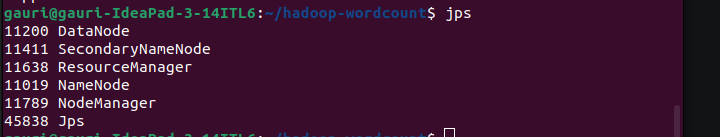
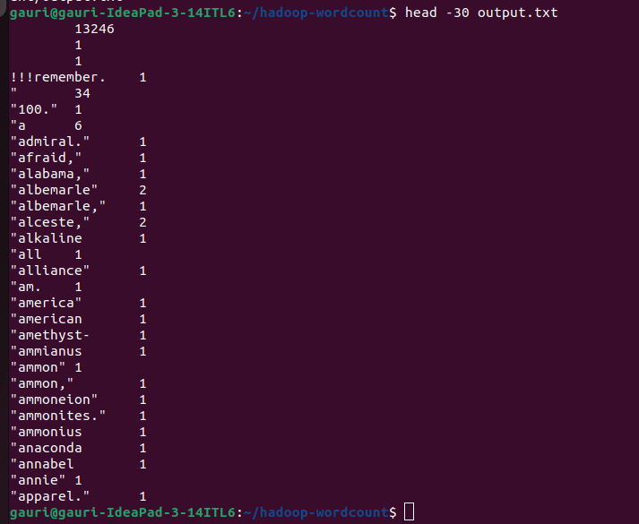
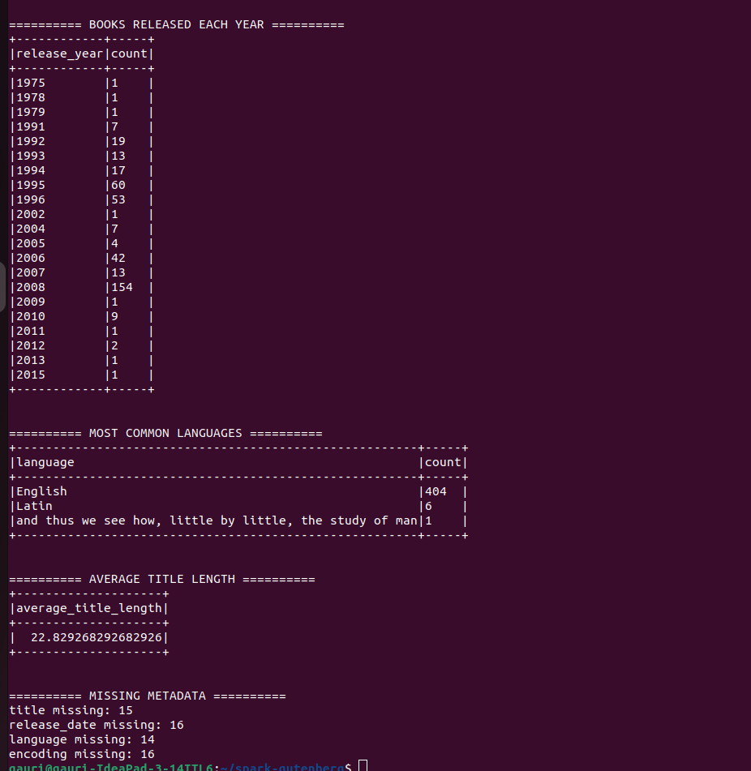
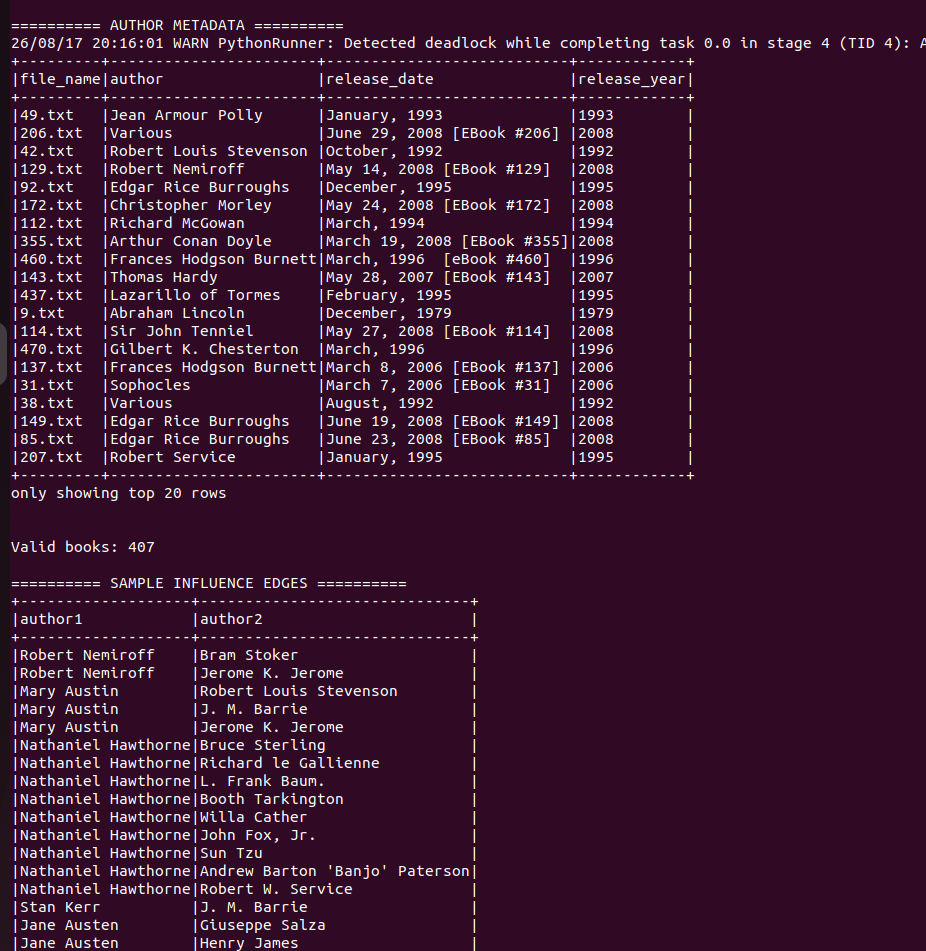
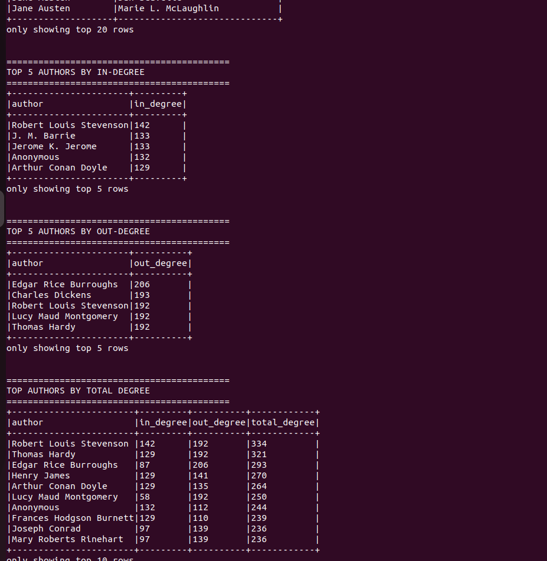

# Hadoop and Apache Spark — Distributed Data Processing Assignment


# 1. Project Overview

This project demonstrates basic distributed data processing using **Apache Hadoop MapReduce** and **Apache Spark / PySpark**.

The Hadoop section focuses on:

- Hadoop installation and configuration
- HDFS operations
- Hadoop MapReduce
- WordCount implementation

The Apache Spark section uses the **Project Gutenberg D184MB dataset** and focuses on:

- Book metadata extraction and analysis
- TF-IDF and cosine similarity
- Author influence network analysis

The project was implemented and tested on a local Ubuntu Linux environment.

---

# 2. Technologies Used

| Technology | Details |
|---|---|
| Operating System | Ubuntu 22.04 |
| Java | Java 11 |
| Apache Hadoop | Hadoop 3.x |
| HDFS | Hadoop Distributed File System |
| YARN | Hadoop Resource Management |
| MapReduce | Hadoop MapReduce |
| Apache Spark | Spark 3.5.9 |
| PySpark | Spark Python API |
| Python | Python 3 |
| Dataset | Project Gutenberg D184MB |

---

# 3. Project Structure

```text
project/
│
├── README.md
│
├── hadoop-wordcount/
│   ├── WordCount.java
│   └── wordcount.jar
│
└── spark-gutenberg/
    │
    ├── task10_metadata.py
    ├── task11_tfidf.py
    ├── task12_influence.py
    │
    └── screenshots/
        ├── java-version.png
        ├── hadoop-version.png
        ├── spark-version.png
        ├── hadoop-services.png
        ├── yarn-node.png
        ├── hdfs-input.png
        ├── wordcount-execution.png
        ├── wordcount-output.png
        ├── task10-execution.png
        ├── task10-metadata.png
        ├── task10-year.png
        ├── task10-language.png
        ├── task10-title-length.png
        ├── task10-missing-metadata.png
        ├── task11-execution.png
        ├── task12-execution.png
        ├── task12-edges.png
        ├── task12-indegree.png
        └── task12-outdegree.png
```

---

# 4. Environment Setup

The project was implemented on Ubuntu Linux.

The following environment variables were configured for Hadoop:

```bash
export JAVA_HOME=/usr/lib/jvm/java-11-openjdk-amd64

export HADOOP_HOME=/usr/local/hadoop
export HADOOP_HDFS_HOME=$HADOOP_HOME
export HADOOP_MAPRED_HOME=$HADOOP_HOME
export HADOOP_YARN_HOME=$HADOOP_HOME
export YARN_HOME=$HADOOP_HOME

export PATH=$PATH:$HADOOP_HOME/bin:$HADOOP_HOME/sbin
```

Spark was also configured through `SPARK_HOME` and added to the system `PATH`.

---


# 4. Hadoop Configuration

Hadoop was configured as a single-node cluster.

The main services used were:

- NameNode
- DataNode
- SecondaryNameNode
- ResourceManager
- NodeManager

HDFS was started using:

```bash
start-dfs.sh
```

YARN was started using:

```bash
start-yarn.sh
```

The running Hadoop services were verified using:

```bash
jps
```

### Screenshot

<!-- INSERT SCREENSHOT: hadoop-services.png -->



---

## 5.1 YARN Node Verification

The available YARN nodes were checked using:

```bash
yarn node -list
```


# 6. HDFS Operations

HDFS was used to store the input file for the MapReduce WordCount program.

The input directory was created using:

```bash
hdfs dfs -mkdir -p /mapreduce/input
```

The input file was uploaded using:

```bash
hdfs dfs -put 200.txt /mapreduce/input/
```

The contents of the input directory were verified using:

```bash
hdfs dfs -ls /mapreduce/input
```

# 7. Hadoop MapReduce — WordCount

## 7.1 Objective

The objective of this task is to implement and execute the classic **WordCount** MapReduce program.

The program counts how many times each word occurs in the input text.

The MapReduce workflow is:

```text
Input File
    |
    v
Mapper
    |
    | (word, 1)
    v
Shuffle and Sort
    |
    v
Reducer
    |
    | (word, total count)
    v
HDFS Output
```

---

# 8. Map Phase

The Mapper reads each line from the input file and splits it into individual words.

For every word, it generates an intermediate key-value pair:

```text
(word, 1)
```

For example:

```text
Hello Hadoop Hello
```

produces:

```text
(Hello, 1)
(Hadoop, 1)
(Hello, 1)
```

The intermediate records are then passed to the Shuffle and Sort phase.

---

# 9. Reduce Phase

The Shuffle and Sort phase groups identical words together.

For example:

```text
Hello → [1, 1, 1, 1]
Hadoop → [1, 1]
```

The Reducer sums the values for each word:

```text
Hello   4
Hadoop  2
```

The final output is stored in HDFS.

---

# 10. Running WordCount

The WordCount program was executed using:

```bash
hadoop jar wordcount.jar WordCount /mapreduce/input /mapreduce/output
```

If the output directory already exists, it can be removed using:

```bash
hdfs dfs -rm -r -f /mapreduce/output
```

Then the job can be executed again.


## WordCount Output

The output directory was checked using:

```bash
hdfs dfs -ls /mapreduce/output
```

The output was displayed using:

```bash
hdfs dfs -cat /mapreduce/output/part-r-00000
```

### Screenshot

<!-- INSERT SCREENSHOT: wordcount-output.png -->



---

# 11. Apache Spark

Apache Spark was used for the second part of the assignment.

Spark was configured with:

```text
Spark Version: 3.5.9
Java Version: 11
Python: Python 3
```

The Spark applications were written using **PySpark**.

Spark was run locally using:

```bash
spark-submit <program>.py
```

---

# 12. Project Gutenberg Dataset

The Spark tasks use the provided **Project Gutenberg D184MB dataset**.

The dataset consists of text files containing books.

The local dataset was located at:

```text
/home/gauri/Downloads/D184MB
```

The dataset contained approximately **425 books** in the local environment.

The books were loaded using Spark's `wholeTextFiles()` functionality.

The basic structure of the data is:

```text
file_name | text
```

where:

- `file_name` represents the name of the Gutenberg text file.
- `text` contains the complete text of the book.

---

# 13. Question 10 — Gutenberg Metadata Extraction

## Objective

The objective of Question 10 is to extract metadata from the Gutenberg books and perform basic analysis.

The metadata fields include:

- Title
- Release Date
- Language
- Encoding

The extracted information is then used to perform additional analysis.

---

## 13.1 Processing Pipeline

```text
Gutenberg Books
       |
       v
Spark wholeTextFiles()
       |
       v
File Name + Text
       |
       v
Metadata Extraction
       |
       +------ Title
       |
       +------ Release Date
       |
       +------ Language
       |
       +------ Encoding
       |
       v
Release Year Analysis
       |
       +------ Books per Year
       |
       +------ Language Frequency
       |
       +------ Average Title Length
       |
       +------ Missing Metadata
```

---

# 14. Q10 — Implementation

The implementation is stored in:

```text
task10_metadata.py
```

It was executed using:

```bash
spark-submit task10_metadata.py
```

### Screenshot

<!-- INSERT SCREENSHOT: task10-execution.png -->



---

# 15. Q10 — Extracted Metadata

The program extracts metadata such as:

```text
Title
Release Date
Language
Encoding
```

### Screenshot

<!-- INSERT SCREENSHOT: task10-metadata.png -->


---

# 16. Q10 — Books Released Per Year

The release date was processed to extract the release year.

The books were then grouped according to their release year to determine the number of books associated with each year.

### Screenshot

<!-- INSERT SCREENSHOT: task10-year.png -->


---

# 17. Q10 — Most Common Language

The extracted language field was used to calculate the frequency of different languages in the dataset.

This allows the most common language in the Gutenberg collection to be identified.

### Screenshot

<!-- INSERT SCREENSHOT: task10-language.png -->


---

# 18. Q10 — Average Title Length

The title of each book was used to calculate its length.

The average title length was then calculated over the available books.

### Screenshot

<!-- INSERT SCREENSHOT: task10-title-length.png -->


---

# 19. Q10 — Missing and Inconsistent Metadata

Metadata extraction from real-world text files can result in missing or inconsistent values.

Some possible issues include:

- Missing metadata fields
- Different formatting of release dates
- Additional spaces
- Different capitalization
- Unexpected metadata formats
- Missing language information
- Missing encoding information

Regular expressions can be adjusted to support additional formats.

For a real-world application, missing values could be stored as `NULL` or another explicit missing-value representation. Data validation and preprocessing could also be applied before analysis.

### Screenshot

<!-- INSERT SCREENSHOT: task10-missing-metadata.png -->


---

# 20. Question 11 — TF-IDF and Cosine Similarity

## Objective

The objective of Question 11 is to calculate TF-IDF representations for the Gutenberg books and identify the books most similar to:

```text
10.txt
```

The task involves:

1. Text preprocessing
2. TF calculation
3. IDF calculation
4. TF-IDF calculation
5. Cosine similarity
6. Identifying the top five similar books

---

# 21. Q11 — Text Preprocessing

The raw Gutenberg text is processed before calculating TF-IDF.

The preprocessing pipeline is:

```text
Raw Book
   |
   v
Remove Gutenberg Header/Footer
   |
   v
Convert to Lowercase
   |
   v
Remove Punctuation
   |
   v
Tokenization
   |
   v
Remove Stop Words
   |
   v
TF-IDF
```

This preprocessing reduces noise and ensures that the text is represented consistently.

---

# 22. Q11 — Term Frequency

Term Frequency measures how often a term occurs within a document.

A common formulation is:

```text
TF(t,d) =
Number of occurrences of term t in document d
------------------------------------------------
Total number of terms in document d
```

A term that occurs frequently in a particular document will have a higher TF value.

---

# 23. Q11 — Inverse Document Frequency

Inverse Document Frequency measures how common or rare a term is across the complete document collection.

A common formulation is:

```text
IDF(t) = log(N / df(t))
```

where:

- `N` is the total number of documents.
- `df(t)` is the number of documents containing term `t`.

Terms that appear in many documents receive lower IDF values.

---

# 24. Q11 — TF-IDF

TF-IDF combines Term Frequency and Inverse Document Frequency:

```text
TF-IDF(t,d) = TF(t,d) × IDF(t)
```

The resulting TF-IDF vector represents the importance of different terms within a particular book.

---

# 25. Q11 — Cosine Similarity

Cosine similarity is used to compare the TF-IDF vectors of two books.

The formula is:

```text
Cosine Similarity(A,B)
=
(A · B)
----------------
||A|| × ||B||
```

A value closer to `1` indicates greater similarity between the two documents.

---

# 26. Q11 — Execution

The implementation is stored in:

```text
task11_tfidf.py
```

The program was executed using:

```bash
spark-submit --driver-memory 2g task11_tfidf.py
```

### Screenshot


## Q11 Observation

The TF-IDF calculation was computationally intensive when executed on the complete Gutenberg dataset in the local single-machine environment.

The program successfully started Spark and processed the dataset, but the complete document-frequency/TF-IDF stage required substantial computation and did not finish within a practical execution time during testing.

Therefore, no fabricated Top-5 similarity results are included.

---

# 27. Question 12 — Author Influence Network

## Objective

The objective of Question 12 is to construct an author influence network based on publication dates.

An influence relationship is created between authors when their publication dates fall within the defined time window.

The implementation uses a **5-year influence window**.

---

# 28. Q12 — Metadata Extraction

The following information is extracted from each book:

```text
Author
Release Date
Release Year
```

The release year is used to compare publication periods between authors.

---

# 29. Q12 — Network Construction

The influence network is represented using author pairs.

Conceptually:

```text
Author A
   |
   | Publication within 5-year window
   v
Author B
```

The processing pipeline is:

```text
Gutenberg Books
       |
       v
Extract Author
       |
       v
Extract Release Date
       |
       v
Extract Release Year
       |
       v
Compare Publication Years
       |
       v
5-Year Influence Window
       |
       v
Author Pairs
       |
       +------------+
       |            |
       v            v
   In-Degree    Out-Degree
       |            |
       +------------+
              |
              v
       Top 5 Authors
```

---

# 30. Q12 — Implementation

The implementation is stored in:

```text
task12_influence.py
```

The program was executed using:

```bash
spark-submit --driver-memory 2g task12_influence.py
```

### Screenshot

<!-- INSERT SCREENSHOT: task12-execution.png -->



---

# 31. Q12 — Influence Edges

The generated author pairs represent the relationships established using the five-year publication window.

### Screenshot

<!-- INSERT SCREENSHOT: task12-edges.png -->


---

# 32. Q12 — In-Degree

In-degree represents the number of incoming relationships associated with an author.

A higher in-degree means that the author has a greater number of incoming relationships under the defined temporal influence rule.

The program calculates and displays the top five authors by in-degree.

### Screenshot

<!-- INSERT SCREENSHOT: task12-indegree.png -->



---

# 33. Q12 — Out-Degree

Out-degree represents the number of outgoing relationships associated with an author.

A higher out-degree means that the author has a greater number of outgoing relationships under the defined temporal influence rule.

The program calculates and displays the top five authors by out-degree.

### Screenshot

<!-- INSERT SCREENSHOT: task12-outdegree.png -->


---

# 34. Effect of the Time Window

The size of the time window affects the density of the author influence network.

A smaller time window generally results in fewer relationships:

```text
Smaller Window
      |
      v
Fewer Edges
      |
      v
Sparser Network
```

A larger time window generally results in more relationships:

```text
Larger Window
      |
      v
More Edges
      |
      v
Denser Network
```

Therefore, changing the influence window can significantly affect the calculated in-degree and out-degree values.

---

# 35. Interpretation of Author Influence

The author influence network should be considered a simplified temporal model.

A connection between two authors does not necessarily prove actual literary influence.

The model is based primarily on publication timing and therefore does not account for:

- Citations
- Literary references
- Writing style
- Genre
- Historical evidence
- Direct communication
- Cultural relationships
- Books actually read by another author

Therefore, high in-degree or out-degree should be interpreted as a strong number of **potential temporal relationships**, rather than definitive proof of literary influence.

---

# 36. Scalability

The dataset used in this project contains hundreds of books, making it practical to process on a local machine.

For much larger datasets, several optimizations could be considered:

- Increasing the number of Spark partitions
- Using efficient joins
- Filtering data before joins
- Caching frequently accessed data
- Using sparse vector representations
- Reducing unnecessary data movement
- Using distributed aggregation
- Avoiding unnecessary Cartesian products

Spark provides distributed execution that can allow these operations to scale across multiple machines and executors.

---

